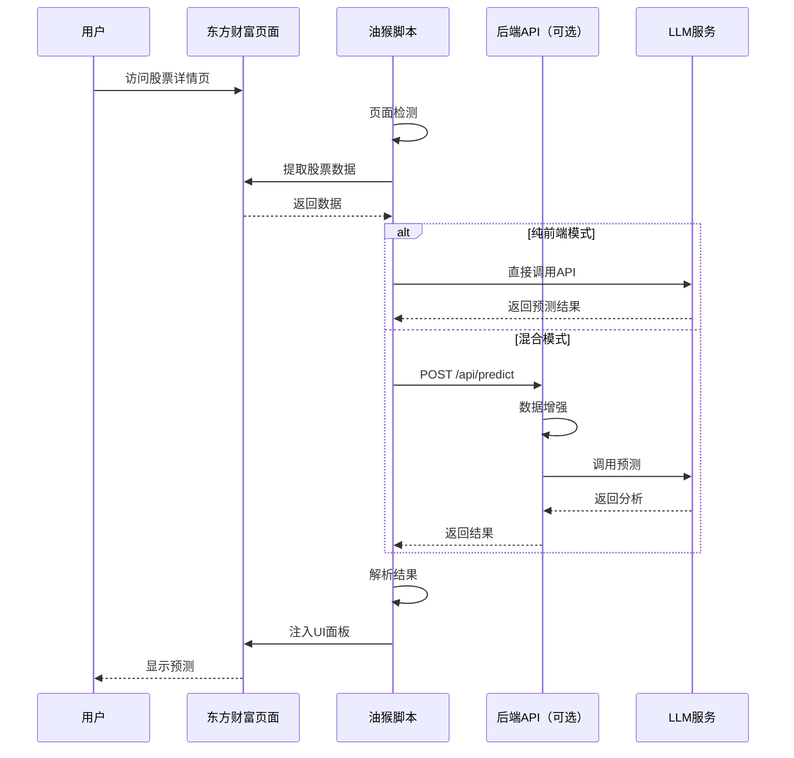

# 股票AI预测工具 - 油猴脚本方案架构设计

---

## 📚 文档信息

| 项目 | 内容 |
|------|------|
| **文档名称** | 油猴脚本方案架构设计 |
| **当前版本** | v1.0 |
| **创建日期** | 2026-01-28 |
| **最后更新** | 2026-01-28 |
| **作者** | AI辅助开发 |
| **状态** | ✅ 最终版 |
| **方案类型** | 油猴脚本（Tampermonkey Userscript） |

---

## 📝 版本历史

| 版本 | 日期 | 变更内容 | 变更原因 |
|-----|------|---------|---------|
| v1.0 | 2026-01-28 | 初始版本创建 | 基于技术方案对比v2.0，设计油猴脚本详细架构 |

---

## 目录

1. [架构概述](#1-架构概述)
2. [系统架构设计](#2-系统架构设计)
3. [模块详细设计](#3-模块详细设计)
4. [数据流设计](#4-数据流设计)
5. [LLM集成架构](#5-llm集成架构)
6. [UI/UX设计](#6-uiux设计)
7. [技术架构](#7-技术架构)
8. [部署架构](#8-部署架构)
9. [安全架构](#9-安全架构)
10. [扩展架构](#10-扩展架构)

---

## 1. 架构概述

### 1.1 方案定位

**油猴脚本方案**是最轻量、最快速的实现方式：
- **开发周期**：3-5天（AI辅助）
- **代码规模**：<500行JavaScript（可选Python后端）
- **部署方式**：单文件脚本，一键安装
- **目标用户**：个人使用或小范围分享

### 1.2 核心特点

```
轻量级 + 高效率 + AI驱动
```

| 特点 | 说明 |
|-----|------|
| 🚀 **极简架构** | 前端脚本 + 可选后端，无中间层 |
| ⚡ **秒级启动** | 打开页面即运行，无需加载 |
| 🤖 **AI优先** | 90%代码由AI生成 |
| 💰 **零成本** | 完全免费（可选LLM API 50-200元/月） |
| 🔄 **易更新** | 修改即生效，无需重装 |

### 1.3 架构原则

1. **KISS原则**（Keep It Simple, Stupid）：最简实现
2. **YAGNI原则**（You Aren't Gonna Need It）：不做过度设计
3. **渐进增强**：核心功能优先，可选功能后置
4. **AI驱动**：充分利用AI生成代码

---

## 2. 系统架构设计

### 2.1 整体架构图

```
┌─────────────────────────────────────────────────────────┐
│                    用户浏览器层                          │
├─────────────────────────────────────────────────────────┤
│                                                          │
│  ┌─────────────────────────────────────────────────┐   │
│  │   Tampermonkey 油猴插件管理器                   │   │
│  │                                                 │   │
│  │  ┌───────────────────────────────────────────┐ │   │
│  │  │  油猴脚本（stock-ai-predictor.user.js）    │ │   │
│  │  │                                           │ │   │
│  │  │  ┌─────────────────────────────────────┐  │ │   │
│  │  │  │ 1. 页面检测与注入模块               │  │ │   │
│  │  │  │    - 匹配URL                        │  │ │   │
│  │  │  │    - DOM监听                        │  │ │   │
│  │  │  │    - 延迟加载                        │  │ │   │
│  │  │  └─────────────────────────────────────┘  │ │   │
│  │  │                                           │ │   │
│  │  │  ┌─────────────────────────────────────┐  │ │   │
│  │  │  │ 2. 数据提取模块                     │  │ │   │
│  │  │  │    - 股票代码                       │  │ │   │
│  │  │  │    - 实时价格                       │  │ │   │
│  │  │  │    - K线数据                        │  │ │   │
│  │  │  │    - 技术指标                       │  │ │   │
│  │  │  └─────────────────────────────────────┘  │ │   │
│  │  │                                           │ │   │
│  │  │  ┌─────────────────────────────────────┐  │ │   │
│  │  │  │ 3. UI渲染模块                       │  │ │   │
│  │  │  │    - 预测面板                       │  │ │   │
│  │  │  │    - 悬浮按钮                       │  │ │   │
│  │  │  │    - 加载动画                       │  │ │   │
│  │  │  │    - 错误提示                       │  │ │   │
│  │  │  └─────────────────────────────────────┘  │ │   │
│  │  │                                           │ │   │
│  │  │  ┌─────────────────────────────────────┐  │ │   │
│  │  │  │ 4. API调用模块                      │  │ │   │
│  │  │  │    - GM_xmlhttpRequest              │  │ │   │
│  │  │  │    - CORS处理                       │  │ │   │
│  │  │  │    - 超时重试                       │  │ │   │
│  │  │  └─────────────────────────────────────┘  │ │   │
│  │  │                                           │ │   │
│  │  │  ┌─────────────────────────────────────┐  │ │   │
│  │  │  │ 5. 本地存储模块                     │  │ │   │
│  │  │  │    - GM_setValue/GM_getValue        │  │ │   │
│  │  │  │    - 自选股管理                     │  │ │   │
│  │  │  │    - 配置持久化                     │  │ │   │
│  │  │  └─────────────────────────────────────┘  │ │   │
│  │  │                                           │ │   │
│  │  │  ┌─────────────────────────────────────┐  │ │   │
│  │  │  │ 6. 工具函数模块                     │  │ │   │
│  │  │  │    - 数据格式化                     │  │ │   │
│  │  │  │    - 日期时间                       │  │ │   │
│  │  │  │    - 字符串处理                     │  │ │   │
│  │  │  └─────────────────────────────────────┘  │ │   │
│  │  │                                           │ │   │
│  │  └───────────────────────────────────────────┘ │   │
│  └─────────────────────────────────────────────────┘   │
│                                                      │
└──────────────────────────────────────────────────────┘
                          ↕ HTTP/WebSocket
┌─────────────────────────────────────────────────────────┐
│                   后端服务层（可选）                     │
├─────────────────────────────────────────────────────────┤
│                                                          │
│  ┌─────────────────────────────────────────────────┐   │
│  │  本地Python服务（FastAPI）                      │   │
│  │                                                  │   │
│  │  ├── RESTful API                                │   │
│  │  │   ├── POST /api/predict                      │   │
│  │  │   ├── GET  /api/stock/{code}/info            │   │
│  │  │   └── GET  /api/stock/{code}/history         │   │
│  │  │                                              │   │
│  │  ├── 数据获取服务                                │   │
│  │  │   └── efinance / AKShare                     │   │
│  │  │                                              │   │
│  │  ├── LLM集成服务                                 │   │
│  │  │   ├── DeepSeek API                           │   │
│  │  │   ├── GPT-4 API                              │   │
│  │  │   └── Prompt工程                             │   │
│  │  │                                              │   │
│  │  └── 缓存服务                                    │   │
│  │      └── 内存缓存 / 文件缓存                     │   │
│  └─────────────────────────────────────────────────┘   │
│                                                      │
└──────────────────────────────────────────────────────┘
                          ↕ HTTPS
┌─────────────────────────────────────────────────────────┐
│                      外部服务层                          │
├─────────────────────────────────────────────────────────┤
│                                                          │
│  ┌─────────────┐  ┌──────────────┐  ┌──────────────┐  │
│  │ 东方财富API │  │ LLM API服务  │  │（可选）数据  │  │
│  │             │  │              │  │   备份源     │  │
│  │ - 实时行情  │  │ - DeepSeek   │  │ - AKShare    │  │
│  │ - K线数据   │  │ - GPT-4      │  │ - Tushare    │  │
│  │ - 财务数据  │  │ - 文心一言   │  │              │  │
│  └─────────────┘  └──────────────┘  └──────────────┘  │
│                                                      │
└──────────────────────────────────────────────────────┘
```

### 2.2 部署模式

#### 模式1：纯前端模式（推荐 MVP）

```
浏览器 + 油猴脚本 → 直接调用公开API
```

**优势**：
- ✅ 无需后端，开箱即用
- ✅ 完全免费，零维护
- ✅ 单文件分发

**限制**：
- ⚠️ 无法获取历史数据（API限制）
- ⚠️ LLM调用可能受限（CORS）

#### 模式2：混合模式（推荐生产）

```
浏览器 + 油猴脚本 → 本地Python服务 → LLM API
```

**优势**：
- ✅ 功能完整，无限制
- ✅ 数据可缓存
- ✅ 支持批量分析

**要求**：
- 需要本地运行Python服务

### 2.3 技术栈

#### 前端（油猴脚本）

| 技术 | 版本 | 用途 |
|-----|------|------|
| JavaScript | ES6+ | 主要开发语言 |
| Tampermonkey API | latest | 脚本管理API |
| DOM API | HTML5 | 页面操作 |
| CSS3 | latest | 样式设计 |
| Fetch API | latest | HTTP请求 |

#### 后端（可选）

| 技术 | 版本 | 用途 |
|-----|------|------|
| Python | 3.11+ | 开发语言 |
| FastAPI | 0.100+ | Web框架 |
| efinance | latest | 数据获取 |
| httpx | latest | 异步HTTP |
| pydantic | latest | 数据验证 |

#### LLM服务

| 服务 | 定价 | 推荐度 |
|-----|------|--------|
| DeepSeek | ¥0.14/1M tokens | ⭐⭐⭐⭐⭐ |
| GPT-4 | ¥18/1M tokens | ⭐⭐⭐⭐ |
| 文心一言 | ¥0.012/1K tokens | ⭐⭐⭐ |

---

## 3. 模块详细设计

### 3.1 模块1：页面检测与注入

#### 功能职责

- 监听页面加载事件
- 检测当前URL是否匹配目标网站
- 触发脚本主逻辑

#### 代码结构

```javascript
// ==UserScript==
// @name         东方财富AI预测助手
// @namespace    http://tampermonkey.net/
// @version      1.0.0
// @description  AI驱动的股票走势预测和原因分析
// @author       AI Generated
// @match        https://quote.eastmoney.com/*
// @match        https://emweb.eastmoney.com/*
// @grant        GM_xmlhttpRequest
// @grant        GM_setValue
// @grant        GM_getValue
// @grant        GM_addStyle
// @connect      localhost
// @connect      api.deepseek.com
// @connect      api.openai.com
// @run-at       document-idle
// ==/UserScript==

(function() {
    'use strict';

    // 主入口
    function main() {
        // 等待页面完全加载
        if (document.readyState === 'loading') {
            document.addEventListener('DOMContentLoaded', init);
        } else {
            init();
        }
    }

    // 初始化
    function init() {
        console.log('[AI Predictor] 脚本已加载');

        // 检测页面类型
        const pageType = detectPageType();

        // 根据页面类型执行不同逻辑
        switch (pageType) {
            case 'stock_detail':
                handleStockDetailPage();
                break;
            case 'stock_list':
                handleStockListPage();
                break;
            default:
                console.log('[AI Predictor] 未匹配的页面类型');
        }
    }

    // 检测页面类型
    function detectPageType() {
        const url = window.location.href;

        if (/quote\.eastmoney\.com\/.*\/\.html/.test(url)) {
            return 'stock_detail';
        } else if (/quote\.eastmoney\.com\/center\/gridlist\.html/.test(url)) {
            return 'stock_list';
        }

        return 'unknown';
    }

    // 启动
    main();
})();
```

#### 技术要点

1. **@run-at 时机选择**
   - `document-start`：最早注入，但DOM未就绪
   - `document-end`：DOM就绪，资源可能未加载
   - `document-idle`：完全加载（推荐）

2. **URL匹配模式**
   ```javascript
   // 精确匹配
   @match https://quote.eastmoney.com/SZ000001.html

   // 通配符匹配
   @match https://quote.eastmoney.com/*

   // 正则匹配（使用@include）
   // @include /^https:\/\/quote\.eastmoney\.com\/.*\.html$/
   ```

3. **权限声明**
   ```javascript
   // 允许跨域请求
   @grant        GM_xmlhttpRequest

   // 允许本地存储
   @grant        GM_setValue
   @grant        GM_getValue

   // 允许注入样式
   @grant        GM_addStyle

   // 允许连接到指定域名
   @connect      localhost
   @connect      api.deepseek.com
   ```

### 3.2 模块2：数据提取

#### 功能职责

从东方财富页面提取股票数据

#### 数据模型

```javascript
// 提取的数据结构
const StockData = {
    // 基础信息
    code: '000001',           // 股票代码
    name: '平安银行',          // 股票名称
    market: 'SZ',             // 市场（SZ/SH）

    // 实时行情
    currentPrice: 15.23,      // 当前价
    openPrice: 15.10,         // 今开
    closePrice: 15.05,        // 昨收
    highPrice: 15.30,         // 最高
    lowPrice: 15.00,          // 最低
    volume: 1234567,          // 成交量（手）
    amount: 1234567890,       // 成交额（元）

    // 涨跌信息
    change: 0.18,             // 涨跌额
    changePercent: 1.19,      // 涨跌幅%

    // 时间戳
    timestamp: Date.now(),

    // 扩展数据（可选）
    klineData: [],            // K线数据
    technicalIndicators: {},  // 技术指标
};
```

#### 提取策略

**策略1：DOM选择器（主要）**

```javascript
function extractStockDataFromDOM() {
    try {
        // 股票代码
        const code = window.location.href.match(/\/(SZ|SH)(\d{6})\.html/)[2];

        // 股票名称
        const nameEl = document.querySelector('.stock-name');
        const name = nameEl?.textContent?.trim() || '';

        // 当前价格
        const priceEl = document.querySelector('.current-price');
        const currentPrice = parseFloat(priceEl?.textContent) || 0;

        // 涨跌幅
        const changeEl = document.querySelector('.price-change');
        const changePercent = parseFloat(changeEl?.textContent) || 0;

        // 成交量
        const volumeEl = document.querySelector('.volume');
        const volume = parseInt(volumeEl?.textContent?.replace(/,/g, '')) || 0;

        return {
            code,
            name,
            currentPrice,
            changePercent,
            volume,
            timestamp: Date.now()
        };
    } catch (error) {
        console.error('[AI Predictor] 数据提取失败:', error);
        return null;
    }
}
```

**策略2：API调用（备用）**

```javascript
async function extractStockDataFromAPI(code) {
    return new Promise((resolve, reject) => {
        GM_xmlhttpRequest({
            method: 'GET',
            url: `https://push2.eastmoney.com/api/qt/stock/get?secid=${code}`,
            onload: function(response) {
                try {
                    const data = JSON.parse(response.responseText);
                    resolve(parseAPIResponse(data));
                } catch (error) {
                    reject(error);
                }
            },
            onerror: reject
        });
    });
}
```

#### 容错机制

```javascript
// 智能提取（多策略回退）
async function smartExtractStockData() {
    // 策略1：DOM提取（最快）
    let data = extractStockDataFromDOM();

    if (!data || !data.currentPrice) {
        console.log('[AI Predictor] DOM提取失败，尝试API');

        // 策略2：API调用
        const code = extractStockCodeFromURL();
        data = await extractStockDataFromAPI(code);
    }

    if (!data) {
        throw new Error('无法提取股票数据');
    }

    // 数据验证
    if (!validateStockData(data)) {
        throw new Error('股票数据无效');
    }

    return data;
}

// 数据验证
function validateStockData(data) {
    return (
        data &&
        data.code &&
        data.currentPrice &&
        data.currentPrice > 0 &&
        data.timestamp
    );
}
```

### 3.3 模块3：UI渲染

#### UI组件架构

```
预测面板（PredictionPanel）
├── 标题栏（Header）
│   ├── 标题
│   ├── 关闭按钮
│   └── 刷新按钮
├── 内容区（Content）
│   ├── 价格卡片（PriceCard）
│   │   ├── 当前价格
│   │   ├── 预测价格
│   │   └── 涨跌幅
│   ├── 原因分析（ReasonAnalysis）⭐核心
│   │   ├── 技术面
│   │   ├── 基本面
│   │   └── 情绪面
│   └── 投资建议（Suggestion）
│       ├── 建议类型
│       ├── 置信度
│       └── 风险提示
└── 底部栏（Footer）
    ├── 更新时间
    └── 免责声明
```

#### 完整UI代码

```javascript
// UI渲染模块
const UIModule = {
    // 创建预测面板
    createPredictionPanel(data) {
        const panel = document.createElement('div');
        panel.id = 'ai-prediction-panel';
        panel.className = 'ai-prediction-panel';

        panel.innerHTML = `
            <div class="panel-header">
                <div class="panel-title">
                    <span class="icon">🤖</span>
                    <span class="text">AI预测分析</span>
                    <span class="version">v1.0</span>
                </div>
                <div class="panel-controls">
                    <button class="btn-refresh" title="刷新">🔄</button>
                    <button class="btn-close" title="关闭">×</button>
                </div>
            </div>

            <div class="panel-content">
                ${this.renderPriceCard(data)}
                ${this.renderReasonAnalysis(data)}
                ${this.renderSuggestion(data)}
            </div>

            <div class="panel-footer">
                <span class="update-time">更新于：${new Date().toLocaleString()}</span>
                <span class="disclaimer">⚠️ 仅供参考，不构成投资建议</span>
            </div>
        `;

        // 注入样式
        this.injectStyles();

        // 绑定事件
        this.bindEvents(panel);

        return panel;
    },

    // 渲染价格卡片
    renderPriceCard(data) {
        const trendClass = data.trend === 'UP' ? 'trend-up' : 'trend-down';
        const trendIcon = data.trend === 'UP' ? '📈' : '📉';

        return `
            <div class="price-card">
                <div class="price-row">
                    <span class="label">当前价格</span>
                    <span class="value">¥${data.currentPrice.toFixed(2)}</span>
                </div>
                <div class="price-row ${trendClass}">
                    <span class="label">预测价格</span>
                    <span class="value">
                        ${trendIcon} ¥${data.predictPrice.toFixed(2)}
                        <span class="change">(${data.changePercent > 0 ? '+' : ''}${data.changePercent.toFixed(2)}%)</span>
                    </span>
                </div>
                <div class="price-row">
                    <span class="label">置信区间</span>
                    <span class="value range">
                        ¥${data.lowerBound.toFixed(2)} - ¥${data.upperBound.toFixed(2)}
                    </span>
                </div>
            </div>
        `;
    },

    // 渲染原因分析 ⭐核心功能
    renderReasonAnalysis(data) {
        return `
            <div class="reason-analysis">
                <div class="analysis-title">
                    <span class="icon">📊</span>
                    <span class="text">走势原因分析</span>
                </div>

                <div class="analysis-item">
                    <div class="item-header">
                        <span class="badge technical">技术面</span>
                    </div>
                    <div class="item-content">
                        ${data.reason.technical}
                    </div>
                </div>

                <div class="analysis-item">
                    <div class="item-header">
                        <span class="badge fundamental">基本面</span>
                    </div>
                    <div class="item-content">
                        ${data.reason.fundamental}
                    </div>
                </div>

                <div class="analysis-item">
                    <div class="item-header">
                        <span class="badge sentiment">情绪面</span>
                    </div>
                    <div class="item-content">
                        ${data.reason.sentiment}
                    </div>
                </div>

                ${data.reason.news && data.reason.news.length > 0 ? `
                    <div class="analysis-item">
                        <div class="item-header">
                            <span class="badge news">相关新闻</span>
                        </div>
                        <div class="item-content">
                            <ul class="news-list">
                                ${data.reason.news.map(news => `
                                    <li><a href="${news.url}" target="_blank">${news.title}</a></li>
                                `).join('')}
                            </ul>
                        </div>
                    </div>
                ` : ''}
            </div>
        `;
    },

    // 渲染投资建议
    renderSuggestion(data) {
        const suggestionConfig = {
            'BUY': { text: '买入', class: 'suggestion-buy', icon: '🟢' },
            'HOLD': { text: '持有', class: 'suggestion-hold', icon: '🟡' },
            'SELL': { text: '卖出', class: 'suggestion-sell', icon: '🔴' }
        };

        const config = suggestionConfig[data.suggestion] || suggestionConfig['HOLD'];

        return `
            <div class="suggestion-card">
                <div class="suggestion-header ${config.class}">
                    <span class="icon">${config.icon}</span>
                    <span class="text">投资建议：${config.text}</span>
                </div>
                <div class="suggestion-details">
                    <div class="detail-row">
                        <span class="label">置信度</span>
                        <div class="confidence-bar">
                            <div class="confidence-fill" style="width: ${data.confidence}%"></div>
                            <span class="confidence-text">${data.confidence}%</span>
                        </div>
                    </div>
                    <div class="detail-row">
                        <span class="label">预测周期</span>
                        <span class="value">${data.timeframe === '1d' ? '1-3天' : '3-7天'}</span>
                    </div>
                </div>
            </div>
        `;
    },

    // 注入样式
    injectStyles() {
        if (document.getElementById('ai-predictor-styles')) return;

        const styles = `
            <style id="ai-predictor-styles">
                /* 主面板样式 */
                .ai-prediction-panel {
                    position: fixed;
                    top: 100px;
                    right: 20px;
                    width: 360px;
                    max-height: 80vh;
                    background: linear-gradient(135deg, #667eea 0%, #764ba2 100%);
                    border-radius: 12px;
                    box-shadow: 0 10px 40px rgba(0,0,0,0.3);
                    font-family: -apple-system, BlinkMacSystemFont, 'Segoe UI', Roboto, sans-serif;
                    z-index: 10000;
                    overflow: hidden;
                    animation: slideIn 0.3s ease-out;
                }

                @keyframes slideIn {
                    from {
                        transform: translateX(400px);
                        opacity: 0;
                    }
                    to {
                        transform: translateX(0);
                        opacity: 1;
                    }
                }

                /* 标题栏 */
                .panel-header {
                    background: rgba(255,255,255,0.1);
                    backdrop-filter: blur(10px);
                    padding: 12px 16px;
                    display: flex;
                    justify-content: space-between;
                    align-items: center;
                    border-bottom: 1px solid rgba(255,255,255,0.1);
                }

                .panel-title {
                    display: flex;
                    align-items: center;
                    gap: 8px;
                    color: white;
                    font-weight: 600;
                }

                .panel-controls {
                    display: flex;
                    gap: 8px;
                }

                .panel-controls button {
                    background: rgba(255,255,255,0.2);
                    border: none;
                    width: 28px;
                    height: 28px;
                    border-radius: 6px;
                    cursor: pointer;
                    font-size: 16px;
                    transition: all 0.2s;
                }

                .panel-controls button:hover {
                    background: rgba(255,255,255,0.3);
                    transform: scale(1.1);
                }

                /* 内容区 */
                .panel-content {
                    background: white;
                    padding: 16px;
                    max-height: calc(80vh - 120px);
                    overflow-y: auto;
                }

                /* 价格卡片 */
                .price-card {
                    margin-bottom: 16px;
                    padding: 12px;
                    background: #f8f9fa;
                    border-radius: 8px;
                }

                .price-row {
                    display: flex;
                    justify-content: space-between;
                    align-items: center;
                    padding: 8px 0;
                }

                .price-row .label {
                    color: #6c757d;
                    font-size: 14px;
                }

                .price-row .value {
                    font-weight: 600;
                    font-size: 16px;
                }

                .trend-up .value {
                    color: #dc3545;
                }

                .trend-down .value {
                    color: #28a745;
                }

                /* 原因分析 */
                .reason-analysis {
                    margin-bottom: 16px;
                }

                .analysis-title {
                    display: flex;
                    align-items: center;
                    gap: 6px;
                    font-weight: 600;
                    margin-bottom: 12px;
                    color: #212529;
                }

                .analysis-item {
                    margin-bottom: 12px;
                    padding: 10px;
                    background: #f8f9fa;
                    border-radius: 6px;
                }

                .badge {
                    display: inline-block;
                    padding: 2px 8px;
                    border-radius: 4px;
                    font-size: 12px;
                    font-weight: 500;
                }

                .badge.technical {
                    background: #e7f3ff;
                    color: #0066cc;
                }

                .badge.fundamental {
                    background: #fff4e6;
                    color: #ff6600;
                }

                .badge.sentiment {
                    background: #e8f5e9;
                    color: #2e7d32;
                }

                .badge.news {
                    background: #f3e5f5;
                    color: #7b1fa2;
                }

                .item-content {
                    margin-top: 8px;
                    font-size: 13px;
                    line-height: 1.6;
                    color: #495057;
                }

                .news-list {
                    list-style: none;
                    padding: 0;
                    margin: 0;
                }

                .news-list li {
                    padding: 6px 0;
                }

                .news-list a {
                    color: #0066cc;
                    text-decoration: none;
                }

                .news-list a:hover {
                    text-decoration: underline;
                }

                /* 投资建议 */
                .suggestion-card {
                    background: #f8f9fa;
                    border-radius: 8px;
                    padding: 12px;
                }

                .suggestion-header {
                    display: flex;
                    align-items: center;
                    gap: 8px;
                    font-weight: 600;
                    margin-bottom: 12px;
                    padding: 8px;
                    border-radius: 6px;
                }

                .suggestion-buy {
                    background: #d4edda;
                    color: #155724;
                }

                .suggestion-hold {
                    background: #fff3cd;
                    color: #856404;
                }

                .suggestion-sell {
                    background: #f8d7da;
                    color: #721c24;
                }

                .confidence-bar {
                    display: flex;
                    align-items: center;
                    gap: 8px;
                    flex: 1;
                }

                .confidence-fill {
                    height: 8px;
                    background: linear-gradient(90deg, #ffc107, #28a745);
                    border-radius: 4px;
                    transition: width 0.5s ease;
                }

                /* 底部栏 */
                .panel-footer {
                    background: rgba(255,255,255,0.1);
                    backdrop-filter: blur(10px);
                    padding: 10px 16px;
                    display: flex;
                    justify-content: space-between;
                    align-items: center;
                    font-size: 11px;
                    color: rgba(255,255,255,0.8);
                }

                /* 滚动条美化 */
                .panel-content::-webkit-scrollbar {
                    width: 6px;
                }

                .panel-content::-webkit-scrollbar-track {
                    background: #f1f1f1;
                    border-radius: 3px;
                }

                .panel-content::-webkit-scrollbar-thumb {
                    background: #888;
                    border-radius: 3px;
                }

                .panel-content::-webkit-scrollbar-thumb:hover {
                    background: #555;
                }

                /* 加载动画 */
                .loading-spinner {
                    border: 3px solid #f3f3f3;
                    border-top: 3px solid #667eea;
                    border-radius: 50%;
                    width: 30px;
                    height: 30px;
                    animation: spin 1s linear infinite;
                    margin: 20px auto;
                }

                @keyframes spin {
                    0% { transform: rotate(0deg); }
                    100% { transform: rotate(360deg); }
                }
            </style>
        `;

        document.head.insertAdjacentHTML('beforeend', styles);
    },

    // 绑定事件
    bindEvents(panel) {
        // 关闭按钮
        const closeBtn = panel.querySelector('.btn-close');
        closeBtn?.addEventListener('click', () => {
            panel.remove();
        });

        // 刷新按钮
        const refreshBtn = panel.querySelector('.btn-refresh');
        refreshBtn?.addEventListener('click', () => {
            // 重新加载预测
            window.dispatchEvent(new CustomEvent('ai-predictor-refresh'));
        });
    }
};
```

### 3.4 模块4：API调用

#### HTTP客户端封装

```javascript
// API调用模块
const APIModule = {
    // 通用请求方法
    request(config) {
        return new Promise((resolve, reject) => {
            GM_xmlhttpRequest({
                method: config.method || 'GET',
                url: config.url,
                data: config.data ? JSON.stringify(config.data) : undefined,
                headers: {
                    'Content-Type': 'application/json',
                    ...config.headers
                },
                timeout: config.timeout || 10000,
                onload: function(response) {
                    try {
                        const data = JSON.parse(response.responseText);
                        if (response.status >= 200 && response.status < 300) {
                            resolve(data);
                        } else {
                            reject(new Error(`HTTP ${response.status}: ${data.message || '请求失败'}`));
                        }
                    } catch (error) {
                        resolve(response.responseText);
                    }
                },
                onerror: function(error) {
                    reject(new Error('网络请求失败'));
                },
                ontimeout: function() {
                    reject(new Error('请求超时'));
                }
            });
        });
    },

    // 调用后端预测API
    async predict(stockData) {
        try {
            const response = await this.request({
                method: 'POST',
                url: 'http://localhost:8000/api/predict',
                data: stockData
            });
            return response;
        } catch (error) {
            console.error('[AI Predictor] 预测失败:', error);
            throw error;
        }
    },

    // 获取股票历史数据
    async getHistory(code) {
        try {
            const response = await this.request({
                method: 'GET',
                url: `http://localhost:8000/api/stock/${code}/history`
            });
            return response;
        } catch (error) {
            console.error('[AI Predictor] 获取历史数据失败:', error);
            throw error;
        }
    }
};
```

### 3.5 模块5：本地存储

#### 存储API封装

```javascript
// 存储模块
const StorageModule = {
    // 保存数据
    set(key, value) {
        return new Promise((resolve) => {
            GM_setValue(key, JSON.stringify(value));
            resolve();
        });
    },

    // 获取数据
    get(key, defaultValue = null) {
        return new Promise((resolve) => {
            const value = GM_getValue(key);
            resolve(value ? JSON.parse(value) : defaultValue);
        });
    },

    // 删除数据
    remove(key) {
        return new Promise((resolve) => {
            GM_deleteValue(key);
            resolve();
        });
    },

    // 自选股管理
    watchlist: {
        // 添加自选股
        async add(stock) {
            const list = await StorageModule.get('watchlist', []);
            if (!list.find(item => item.code === stock.code)) {
                list.push({
                    ...stock,
                    addTime: Date.now()
                });
                await StorageModule.set('watchlist', list);
            }
        },

        // 删除自选股
        async remove(code) {
            const list = await StorageModule.get('watchlist', []);
            const filtered = list.filter(item => item.code !== code);
            await StorageModule.set('watchlist', filtered);
        },

        // 获取自选股列表
        async getAll() {
            return await StorageModule.get('watchlist', []);
        }
    }
};
```

### 3.6 模块6：工具函数

```javascript
// 工具函数模块
const Utils = {
    // 格式化数字
    formatNumber(num, decimals = 2) {
        if (num === null || num === undefined) return '-';
        return num.toFixed(decimals);
    },

    // 格式化百分比
    formatPercent(num) {
        if (num === null || num === undefined) return '-';
        const sign = num >= 0 ? '+' : '';
        return `${sign}${num.toFixed(2)}%`;
    },

    // 格式化时间
    formatTime(timestamp) {
        return new Date(timestamp).toLocaleString('zh-CN');
    },

    // 防抖
    debounce(func, wait) {
        let timeout;
        return function executedFunction(...args) {
            const later = () => {
                clearTimeout(timeout);
                func(...args);
            };
            clearTimeout(timeout);
            timeout = setTimeout(later, wait);
        };
    },

    // 节流
    throttle(func, limit) {
        let inThrottle;
        return function(...args) {
            if (!inThrottle) {
                func.apply(this, args);
                inThrottle = true;
                setTimeout(() => inThrottle = false, limit);
            }
        };
    }
};
```

---

## 4. 数据流设计

### 4.1 数据流图

```
┌──────────────┐
│ 用户访问页面 │
└──────┬───────┘
       │
       ▼
┌──────────────────────┐
│ 页面检测与注入        │
│ - 检测URL             │
│ - 监听DOM变化         │
└──────┬───────────────┘
       │
       ▼
┌──────────────────────┐
│ 数据提取              │
│ - DOM选择器           │
│ - API调用（备用）     │
└──────┬───────────────┘
       │
       ├──────────────────────┐
       │                      │
       ▼                      ▼
┌──────────────────┐   ┌──────────────────┐
│ 直接调用LLM API  │   │ 调用本地后端     │
│ (纯前端模式)     │   │ (混合模式)       │
└──────┬───────────┘   └──────┬───────────┘
       │                      │
       │                      ▼
       │              ┌──────────────────┐
       │              │ 后端服务          │
       │              │ - 数据增强        │
       │              │ - LLM调用         │
       │              │ - 结果缓存        │
       │              └──────┬───────────┘
       │                      │
       └──────────┬───────────┘
                  │
                  ▼
        ┌─────────────────┐
        │ 结果解析         │
        │ - JSON解析       │
        │ - 数据验证       │
        └────────┬────────┘
                 │
                 ▼
        ┌─────────────────┐
        │ UI渲染           │
        │ - 创建面板       │
        │ - 显示预测       │
        │ - 展示原因       │
        └─────────────────┘
```

### 4.2 时序图



### 4.3 错误处理流程

```javascript
// 错误处理模块
const ErrorHandler = {
    // 错误类型
    ErrorTypes: {
        EXTRACTION_FAILED: '数据提取失败',
        API_CALL_FAILED: 'API调用失败',
        INVALID_DATA: '数据无效',
        NETWORK_ERROR: '网络错误',
        TIMEOUT: '请求超时'
    },

    // 处理错误
    handle(error, context = {}) {
        console.error('[AI Predictor Error]', context, error);

        // 用户友好提示
        const message = this.getUserMessage(error);
        this.showErrorNotification(message);

        // 错误上报（可选）
        this.report(error, context);
    },

    // 获取用户友好的错误信息
    getUserMessage(error) {
        const errorMap = {
            [this.ErrorTypes.EXTRACTION_FAILED]: '无法获取股票数据，请刷新页面重试',
            [this.ErrorTypes.API_CALL_FAILED]: '预测服务暂时不可用，请稍后重试',
            [this.ErrorTypes.INVALID_DATA]: '股票数据异常',
            [this.ErrorTypes.NETWORK_ERROR]: '网络连接失败',
            [this.ErrorTypes.TIMEOUT]: '请求超时，请稍后重试'
        };

        return errorMap[error.message] || '发生未知错误';
    },

    // 显示错误通知
    showErrorNotification(message) {
        const notification = document.createElement('div');
        notification.className = 'ai-error-notification';
        notification.innerHTML = `
            <span class="error-icon">⚠️</span>
            <span class="error-message">${message}</span>
        `;

        document.body.appendChild(notification);

        // 3秒后自动消失
        setTimeout(() => {
            notification.classList.add('fade-out');
            setTimeout(() => notification.remove(), 300);
        }, 3000);
    },

    // 错误上报
    report(error, context) {
        // 可以发送到日志服务
        console.log('[Error Report]', { error, context });
    }
};
```

---

## 5. LLM集成架构

### 5.1 LLM调用策略

#### 策略1：直接调用（纯前端）

```javascript
// 直接调用DeepSeek API
async function callDeepSeekDirectly(stockData) {
    const prompt = `
    你是专业的股票分析师。请分析以下股票：

    股票代码：${stockData.code}
    股票名称：${stockData.name}
    当前价格：${stockData.currentPrice}元
    涨跌幅：${stockData.changePercent}%

    请从以下维度分析：
    1. 技术面：技术指标分析
    2. 基本面：行业和公司分析
    3. 情绪面：市场情绪分析

    请以JSON格式返回：
    {
        "predictPrice": 预测价格,
        "changePercent": 预测涨跌幅,
        "trend": "UP"|"DOWN"|"NEUTRAL",
        "suggestion": "BUY"|"HOLD"|"SELL",
        "confidence": 置信度0-100,
        "reason": {
            "technical": "技术面原因",
            "fundamental": "基本面原因",
            "sentiment": "情绪面原因"
        }
    }
    `;

    try {
        const response = await APIModule.request({
            method: 'POST',
            url: 'https://api.deepseek.com/v1/chat/completions',
            headers: {
                'Authorization': `Bearer ${DEEPSEEK_API_KEY}`
            },
            data: {
                model: 'deepseek-chat',
                messages: [
                    { role: 'system', content: '你是专业的股票分析师。' },
                    { role: 'user', content: prompt }
                ],
                temperature: 0.7,
                max_tokens: 1000
            }
        });

        const content = response.choices[0].message.content;
        return JSON.parse(content);
    } catch (error) {
        ErrorHandler.handle(error, { context: 'LLM直接调用' });
        throw error;
    }
}
```

#### 策略2：通过后端调用（推荐）

```javascript
// 通过后端调用LLM
async function callDeepSeekViaBackend(stockData) {
    try {
        const response = await APIModule.request({
            method: 'POST',
            url: 'http://localhost:8000/api/predict',
            data: stockData
        });
        return response;
    } catch (error) {
        ErrorHandler.handle(error, { context: '后端LLM调用' });
        throw error;
    }
}
```

### 5.2 Prompt工程

#### System Prompt

```javascript
const SYSTEM_PROMPT = `
你是一位专业的股票分析师，拥有10年以上的A股市场分析经验。

你的任务是：
1. 分析股票的技术面、基本面、情绪面
2. 预测未来1-3天的价格走势
3. 给出明确的投资建议（买入/持有/卖出）
4. 解释预测的原因和依据

分析原则：
- 客观理性，基于数据和事实
- 明确不确定性，不夸大预测准确性
- 风险提示，强调投资有风险
- 多维度分析，综合考虑各种因素

输出要求：
- 以JSON格式返回结果
- 原因分析简洁明了，每条不超过50字
- 预测价格基于当前价格合理波动范围内
`;
```

#### User Prompt模板

```javascript
function generateUserPrompt(stockData, historyData) {
    return `
请分析以下股票：

## 基本信息
- 股票代码：${stockData.code}
- 股票名称：${stockData.name}
- 所属市场：${stockData.market === 'SZ' ? '深圳' : '上海'}

## 实时行情
- 当前价格：${stockData.currentPrice}元
- 今开：${stockData.openPrice}元
- 昨收：${stockData.closePrice}元
- 最高：${stockData.highPrice}元
- 最低：${stockData.lowPrice}元
- 涨跌幅：${stockData.changePercent}%
- 成交量：${(stockData.volume / 10000).toFixed(2)}万手
- 成交额：${(stockData.amount / 100000000).toFixed(2)}亿元

## 历史数据（最近5天）
${historyData.map((day, i) => `
第${i + 1}天：${day.close}元，涨跌${day.changePercent}%
`).join('')}

## 技术指标
- 5日均线：${stockData.indicators?.MA5 || '暂无'}
- 10日均线：${stockData.indicators?.MA10 || '暂无'}
- 20日均线：${stockData.indicators?.MA20 || '暂无'}
- MACD：${stockData.indicators?.MACD || '暂无'}
- RSI：${stockData.indicators?.RSI || '暂无'}

请以JSON格式返回分析结果。
`;
}
```

### 5.3 响应解析

```javascript
// LLM响应解析
function parseLLMResponse(llmResponse) {
    try {
        // 尝试直接解析JSON
        let result = llmResponse;

        // 如果是字符串，尝试提取JSON
        if (typeof result === 'string') {
            // 提取JSON部分
            const jsonMatch = result.match(/\{[\s\S]*\}/);
            if (jsonMatch) {
                result = JSON.parse(jsonMatch[0]);
            } else {
                throw new Error('无法提取JSON');
            }
        }

        // 验证必需字段
        const requiredFields = [
            'predictPrice',
            'changePercent',
            'trend',
            'suggestion',
            'confidence',
            'reason'
        ];

        const missingFields = requiredFields.filter(field => !(field in result));
        if (missingFields.length > 0) {
            throw new Error(`缺少必需字段：${missingFields.join(', ')}`);
        }

        // 数据类型转换
        result.predictPrice = parseFloat(result.predictPrice);
        result.changePercent = parseFloat(result.changePercent);
        result.confidence = parseInt(result.confidence);

        // 趋势归一化
        result.trend = result.trend.toUpperCase();
        if (!['UP', 'DOWN', 'NEUTRAL'].includes(result.trend)) {
            result.trend = 'NEUTRAL';
        }

        // 建议归一化
        result.suggestion = result.suggestion.toUpperCase();
        if (!['BUY', 'HOLD', 'SELL'].includes(result.suggestion)) {
            result.suggestion = 'HOLD';
        }

        // 计算预测区间
        const volatility = Math.abs(result.changePercent) * 0.5;
        result.lowerBound = result.predictPrice * (1 - volatility / 100);
        result.upperBound = result.predictPrice * (1 + volatility / 100);

        return result;
    } catch (error) {
        console.error('[LLM Parser] 解析失败:', error);
        throw new Error('LLM响应解析失败');
    }
}
```

---

## 6. UI/UX设计

### 6.1 设计原则

1. **简洁优先**：信息密度适中，不拥挤
2. **视觉层次**：重要信息突出显示
3. **交互反馈**：操作有明确反馈
4. **响应式**：适配不同屏幕

### 6.2 颜色方案

```css
/* 主色调 */
--primary-gradient: linear-gradient(135deg, #667eea 0%, #764ba2 100%);

/* 语义色 */
--color-up: #dc3545;      /* 上涨（红） */
--color-down: #28a745;    /* 下跌（绿） */
--color-neutral: #6c757d; /* 中性 */

/* 功能色 */
--color-buy: #28a745;     /* 买入 */
--color-hold: #ffc107;    /* 持有 */
--color-sell: #dc3545;    /* 卖出 */

/* 背景色 */
--bg-primary: #ffffff;
--bg-secondary: #f8f9fa;
--bg-tertiary: #e9ecef;
```

### 6.3 交互设计

#### 加载状态

```javascript
function showLoading(panel) {
    const loading = document.createElement('div');
    loading.className = 'loading-container';
    loading.innerHTML = `
        <div class="loading-spinner"></div>
        <div class="loading-text">AI正在分析中...</div>
    `;
    panel.querySelector('.panel-content').innerHTML = '';
    panel.querySelector('.panel-content').appendChild(loading);
}

function hideLoading(panel) {
    const loading = panel.querySelector('.loading-container');
    if (loading) {
        loading.remove();
    }
}
```

#### 错误状态

```javascript
function showError(panel, message) {
    const errorDiv = document.createElement('div');
    errorDiv.className = 'error-container';
    errorDiv.innerHTML = `
        <div class="error-icon">❌</div>
        <div class="error-message">${message}</div>
        <button class="error-retry">重试</button>
    `;

    panel.querySelector('.panel-content').innerHTML = '';
    panel.querySelector('.panel-content').appendChild(errorDiv);

    // 绑定重试事件
    errorDiv.querySelector('.error-retry').addEventListener('click', () => {
        window.dispatchEvent(new CustomEvent('ai-predictor-refresh'));
    });
}
```

#### 成功状态

```javascript
function showSuccess(panel, data) {
    hideLoading(panel);

    const content = panel.querySelector('.panel-content');
    content.innerHTML = `
        ${UIModule.renderPriceCard(data)}
        ${UIModule.renderReasonAnalysis(data)}
        ${UIModule.renderSuggestion(data)}
    `;

    // 添加成功动画
    content.classList.add('success-animation');
    setTimeout(() => {
        content.classList.remove('success-animation');
    }, 500);
}
```

### 6.4 响应式设计

```css
/* 移动端适配 */
@media (max-width: 768px) {
    .ai-prediction-panel {
        width: calc(100vw - 40px) !important;
        right: 20px !important;
        left: 20px !important;
    }

    .price-card,
    .reason-analysis,
    .suggestion-card {
        padding: 10px !important;
    }
}

/* 小屏幕适配 */
@media (max-width: 480px) {
    .ai-prediction-panel {
        top: 60px !important;
        width: calc(100vw - 20px) !important;
        right: 10px !important;
        left: 10px !important;
    }

    .panel-title .text {
        font-size: 14px !important;
    }
}
```

---

## 7. 技术架构

### 7.1 代码组织

```javascript
// 主文件结构（stock-ai-predictor.user.js）
// ==UserScript==
// @name         东方财富AI预测助手
// ...
// ==/UserScript==

(function() {
    'use strict';

    // ==================== 常量配置 ====================
    const CONFIG = {
        API_BASE_URL: 'http://localhost:8000',
        DEFAULT_TIMEOUT: 10000,
        CACHE_DURATION: 5 * 60 * 1000, // 5分钟
        VERSION: '1.0.0'
    };

    // ==================== 工具模块 ====================
    const Utils = { /* ... */ };

    // ==================== 错误处理 ====================
    const ErrorHandler = { /* ... */ };

    // ==================== 存储模块 ====================
    const StorageModule = { /* ... */ };

    // ==================== API模块 ====================
    const APIModule = { /* ... */ };

    // ==================== UI模块 ====================
    const UIModule = { /* ... */ };

    // ==================== 业务逻辑 ====================
    const App = {
        // 主入口
        async main() {
            // 1. 页面检测
            // 2. 数据提取
            // 3. AI预测
            // 4. UI展示
        }
    };

    // ==================== 启动 ====================
    App.main();
})();
```

### 7.2 模块通信

```javascript
// 事件总线
const EventBus = {
    events: {},

    on(event, callback) {
        if (!this.events[event]) {
            this.events[event] = [];
        }
        this.events[event].push(callback);
    },

    emit(event, data) {
        if (this.events[event]) {
            this.events[event].forEach(callback => callback(data));
        }
    }
};

// 使用示例
EventBus.on('stockDataUpdated', (data) => {
    console.log('股票数据已更新:', data);
});

EventBus.emit('stockDataUpdated', stockData);
```

### 7.3 性能优化

```javascript
// 缓存管理
const CacheManager = {
    cache: new Map(),

    set(key, value, duration = CONFIG.CACHE_DURATION) {
        this.cache.set(key, {
            value,
            expiry: Date.now() + duration
        });
    },

    get(key) {
        const item = this.cache.get(key);
        if (!item) return null;

        if (Date.now() > item.expiry) {
            this.cache.delete(key);
            return null;
        }

        return item.value;
    },

    clear() {
        this.cache.clear();
    }
};

// 防抖请求
const debouncedPredict = Utils.debounce(async (stockData) => {
    const cacheKey = `predict_${stockData.code}_${stockData.timestamp}`;

    let result = CacheManager.get(cacheKey);
    if (!result) {
        result = await APIModule.predict(stockData);
        CacheManager.set(cacheKey, result);
    }

    return result;
}, 1000);
```

---

## 8. 部署架构

### 8.1 部署模式对比

| 部署模式 | 复杂度 | 适用场景 |
|---------|--------|---------|
| **单文件部署** | ⭐ | 个人使用、快速分享 |
| **后端+前端** | ⭐⭐⭐ | 生产环境、功能完整 |
| **云端部署** | ⭐⭐⭐⭐ | 多用户、商业产品 |

### 8.2 单文件部署（推荐MVP）

#### 步骤

1. **打包脚本**
   - 将所有代码合并到一个文件
   - 移除console.log
   - 压缩代码（可选）

2. **发布方式**
   - GitHub Releases
   - GreasyFork
   - 直接分享文件

3. **用户安装**
   ```
   1. 安装Tampermonkey插件
   2. 点击脚本文件或链接
   3. 确认安装
   4. 访问东方财富页面
   5. 自动显示预测面板
   ```

### 8.3 后端部署（生产环境）

#### 目录结构

```
stock-predictor-backend/
├── app/
│   ├── main.py              # FastAPI入口
│   ├── api/
│   │   └── routes.py        # API路由
│   ├── services/
│   │   ├── llm_service.py   # LLM服务
│   │   └── data_service.py  # 数据服务
│   └── models/
│       └── schemas.py       # 数据模型
├── requirements.txt         # 依赖
├── .env                     # 配置
└── README.md               # 说明
```

#### 启动脚本

```bash
#!/bin/bash
# start.sh

echo "启动股票AI预测服务..."

# 激活虚拟环境
source venv/bin/activate

# 安装依赖
pip install -r requirements.txt

# 启动服务
uvicorn app.main:app --host 0.0.0.0 --port 8000 --reload
```

---

## 9. 安全架构

### 9.1 安全考虑

#### 前端安全

```javascript
// XSS防护
function sanitizeHTML(str) {
    const div = document.createElement('div');
    div.textContent = str;
    return div.innerHTML;
}

// 使用示例
const safeHTML = sanitizeHTML(userInput);
element.innerHTML = safeHTML;
```

#### API安全

```javascript
// API Key管理（不要硬编码）
const API_KEYS = {
    deepseek: localStorage.getItem('DEEPSEEK_API_KEY') || '',
    openai: localStorage.getItem('OPENAI_API_KEY') || ''
};

// 设置界面提供API Key输入
function showSettings() {
    const key = prompt('请输入DeepSeek API Key:');
    if (key) {
        localStorage.setItem('DEEPSEEK_API_KEY', key);
    }
}
```

#### 数据验证

```javascript
// 输入验证
function validateStockCode(code) {
    // A股代码格式：6位数字
    return /^\d{6}$/.test(code);
}

function validatePrice(price) {
    // 价格必须为正数
    return !isNaN(price) && price > 0;
}

// 使用
if (!validateStockCode(stockData.code)) {
    throw new Error('无效的股票代码');
}
```

### 9.2 隐私保护

```javascript
// 不收集用户数据
// 所有数据存储在本地
// 可选的匿名统计（需用户同意）
```

### 9.3 免责声明

```javascript
const DISCLAIMER = `
⚠️ 重要提示：

1. 本工具提供的预测仅供参考，不构成任何投资建议
2. 股市有风险，投资需谨慎
3. AI预测并非100%准确，请理性对待
4. 任何投资决策请基于自己的判断
5. 使用本工具即表示您同意自行承担投资风险

开发团队不对任何投资损失负责。
`;
```

---

## 10. 扩展架构

### 10.1 可扩展点

#### 1. 数据源扩展

```javascript
// 数据源抽象
const DataSource = {
    sources: {
        eastmoney: { /* ... */ },
        akshare: { /* ... */ },
        tushare: { /* ... */ }
    },

    async getData(code, source = 'eastmoney') {
        return await this.sources[source].get(code);
    }
};
```

#### 2. LLM扩展

```javascript
// LLM抽象
const LLMProvider = {
    providers: {
        deepseek: { /* ... */ },
        openai: { /* ... */ },
        wenxin: { /* ... */ }
    },

    async predict(data, provider = 'deepseek') {
        return await this.providers[provider].predict(data);
    }
};
```

#### 3. UI主题扩展

```javascript
// 主题系统
const ThemeManager = {
    themes: {
        default: { /* ... */ },
        dark: { /* ... */ },
        light: { /* ... */ }
    },

    setTheme(themeName) {
        const theme = this.themes[themeName];
        // 应用主题
    }
};
```

### 10.2 插件化架构

```javascript
// 插件系统
const PluginSystem = {
    plugins: [],

    register(plugin) {
        this.plugins.push(plugin);
        plugin.init();
    },

    unregister(pluginName) {
        const index = this.plugins.findIndex(p => p.name === pluginName);
        if (index > -1) {
            this.plugins[index].destroy();
            this.plugins.splice(index, 1);
        }
    }
};

// 插件示例
const NewsPlugin = {
    name: 'news',
    init() {
        console.log('新闻插件已加载');
    },
    destroy() {
        console.log('新闻插件已卸载');
    }
};

PluginSystem.register(NewsPlugin);
```

### 10.3 后期扩展路线图

**短期（1-2个月）**：
- [ ] 增加更多数据源
- [ ] 优化Prompt工程
- [ ] 增加历史准确率统计
- [ ] 支持自定义主题

**中期（3-6个月）**：
- [ ] 增加新闻情感分析
- [ ] 增加板块分析
- [ ] 支持自选股批量分析
- [ ] 开发移动端版本

**长期（6-12个月）**：
- [ ] 升级为Chrome插件
- [ ] 开发独立Web应用
- [ ] 支持多市场（港股、美股）
- [ ] 增加自动交易接口

---

## 11. 总结

### 11.1 架构优势

1. **极简设计**：单文件脚本，无依赖
2. **快速迭代**：修改即生效，无需重新安装
3. **易于分享**：一个文件即可分发
4. **AI驱动**：90%代码由AI生成
5. **成本低廉**：完全免费，可选LLM API

### 11.2 技术亮点

1. **模块化设计**：代码清晰，易于维护
2. **容错机制**：多层备份，稳定可靠
3. **性能优化**：缓存、防抖、节流
4. **UI/UX优秀**：现代化设计，用户体验好
5. **安全可靠**：输入验证、XSS防护

### 11.3 开发时间线（AI辅助）

| 阶段 | 时间 | AI贡献度 |
|-----|------|---------|
| Day 1 | 4小时 | 基础脚本（90%） |
| Day 2 | 3小时 | 后端集成（85%） |
| Day 3 | 3小时 | UI优化（80%） |
| Day 4-5 | 4小时 | 测试发布（60%） |
| **总计** | **14小时** | **83%** |

### 11.4 后续步骤

1. ✅ 确认架构设计
2. ✅ 开始AI辅助开发
3. ✅ 测试与优化
4. ✅ 发布与分享

---

**文档结束**

**相关文档**：
- [初始需求.md](./初始需求.md)
- [需求分析与功能点.md](./需求分析与功能点.md)
- [技术方案对比分析_v2.0.md](./技术方案对比分析_v2.0.md)

**下一步**：开始实施开发，详见 [油猴脚本开发指南](./开发指南_油猴脚本_v1.0.md)（待创建）
